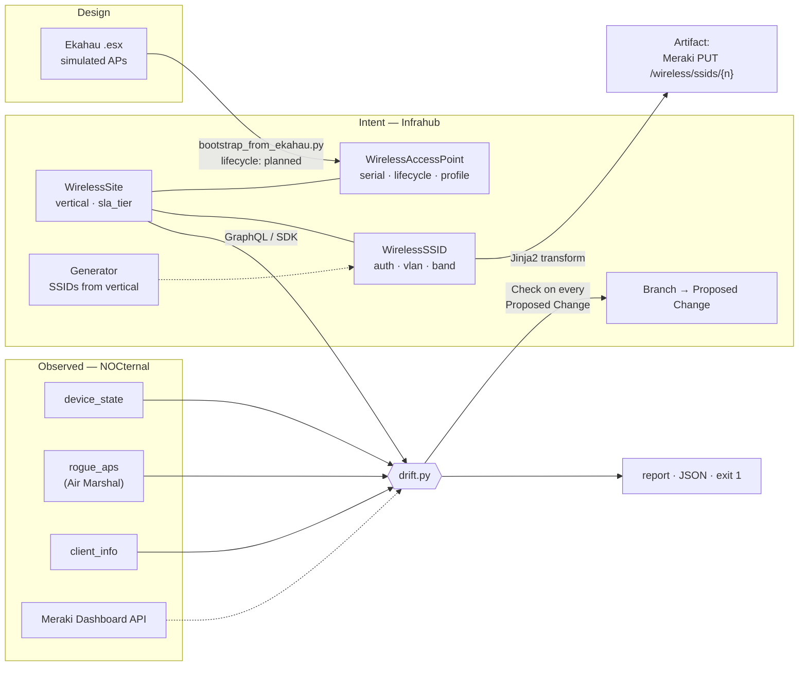

# nocternal-infrahub

[](https://github.com/fintheman/nocternal-infrahub/actions/workflows/ci.yml)

**Intended wireless state in [Infrahub](https://github.com/opsmill/infrahub). Observed wireless state from a NOC's collectors. The diff is the drift report.**

Infrahub is a source of truth for what the network is *supposed* to be. A monitoring platform knows what it
*actually* is. Nobody owns the seam between them, and that seam is where every rogue AP, every leftover
`Setup-Temp` SSID, every "who renamed that access point" lives. This repo is a small, working bridge across it
for cloud-managed wireless (Meraki first; the schema is vendor-neutral).



## What's here

| File | Purpose |
|---|---|
| `schema/nocternal_wireless.yml` | Infrahub schema: `WirelessSite`, `WirelessAccessPoint`, `WirelessSSID` — lifecycle, auth mode, band, VLAN, SLA tier. Loads clean on Infrahub 1.11. |
| `seed_site.py` | Loads a site's intended state into Infrahub through the Python SDK. Idempotent; `--branch` aware. |
| `drift.py` | The engine. Intent from Infrahub (any branch) or JSON; observed from NOCternal's SQLite store, the Meraki API, or JSON. Prints a report, writes JSON, exits 1 on drift. |
| `bootstrap_intent.py` | Day-one intent from what already exists — from the Meraki API or from NOCternal's `device_state`. Edit the result; that edit *is* your intent. |
| `queries/site_intent.gql` | The GraphQL query on its own, for the Infrahub sandbox. |
| `fixtures/` | A synthetic 7-AP / 3-SSID site (`NASH-HQ`) as intended, as the dashboard reports it (nine planted faults), and as a future 6 GHz refresh. |
| `bootstrap_from_ekahau.py` | An Ekahau `.esx` survey → `lifecycle: planned` APs with floor and model. The design tool feeds intent. |
| `.infrahub.yml` | Makes this repo an Infrahub *repository*: it contributes the schema, the query, a drift **Check**, and an **Artifact** definition. |
| `checks/wireless_drift.py` | `InfrahubCheck` around `compare()` — runs on every Proposed Change; critical drift = red X. |
| `templates/meraki_ssids.json.j2` | Jinja2 transform: each site's SSIDs rendered as the Meraki API `PUT` calls that would enforce them. |
| `generators/site_wireless.py` | Infrahub **Generator**: the standard SSID set for a site's `vertical` (healthcare / venue / office / retail), created from a template. `demo_generator.sh` shows it. |
| `fleet_drift.py` | The NOCternal adapter across *every* wireless network in the store — one table, one sentence. `--anonymize` for screen-sharing. |
| `demo_all.sh` | The whole story in order with a pause between beats. Rehearse it, record it, share it. |
| `tests/` | Offline tests for the check, the template, the generator, the Ekahau importer and the fleet roll-up. `python3 -m pytest -q tests/` |
| `setup_mac.sh` | Docker engine on a Mac without Docker Desktop (Colima via Homebrew). |
| `demo.sh` / `demo_branch.sh` | Infrahub up → schema → seed → drift, then the branch scenario. |

## Run it in ten seconds (no Infrahub, no Meraki)

```
python3 drift.py --site NASH-HQ --intent fixtures/intent_nash_hq.json --observed fixtures/observed_nash_hq.json
```

```
NOCternal drift report — site NASH-HQ   intent: file:intent_nash_hq.json@main   observed: file:observed_nash_hq.json
================================================================================================
!! crit DOWN            NASH-HQ-AP-2F-03             intent in_service, dashboard says offline
!! crit EVIL_TWIN       NOCternal-Corp               our SSID name broadcast from a BSSID we don't own: 02:11:22:33:44:55 (seen on the WIRE)
!! crit MISSING         NASH-HQ-AP-2F-05             in intent as in_service but NOT in the dashboard
!! crit SSID_UNEXPECTED Setup-Temp                   broadcasting (psk, vlan 1) with no entry in intent
 ! warn MISMATCH        NASH-HQ-AP-2F-04.model       intent='MR57' observed='MR46'
 ! warn MISMATCH        NASH-HQ-AP-2F-04.name        intent='NASH-HQ-AP-2F-04' observed='nash-ap-2f-4'
 ! warn UNEXPECTED      MR33-spare                   MR33 Q2XX-OLD0-0099 is in the dashboard but not in the source of truth
   info NEIGHBOR        xfinitywifi                  foreign SSID from a0:b1:c2:d3:e4:f5, not on our wire
   info PLANNED         NASH-HQ-AP-3F-07             planned in intent, not claimed yet (expected)
------------------------------------------------------------------------------------------------
4 critical, 3 warning, 2 info   ->   DRIFT
```

Every line is something a wireless engineer has chased at 2 a.m. The point of the project is that each one is
now a *typed* finding (`kind`, `severity`, `object`, `intent`, `observed`) that a NOC can ticket, and that the
"intent" side lives somewhere with branches, diffs, and review.

## Run it against a real Infrahub

```
./setup_mac.sh        # Mac only: Colima + docker CLI, no Docker Desktop. Skip if you have Docker.
./demo.sh             # compose up (Infrahub 1.11 CE) → schema load → seed NASH-HQ → drift
```

`demo.sh` exports the connection for its own run only. For anything you run by hand afterwards:

```
source .venv/bin/activate
export INFRAHUB_ADDRESS=http://localhost:8000 INFRAHUB_API_TOKEN=06438eb2-8019-4776-878c-0941b1f1d1ec   # demo compose default
```

Then open `http://localhost:8000` (`admin` / `infrahub`). The **Wireless** section in the left menu — Sites,
Access Points, SSIDs — was generated from the YAML. `http://localhost:8000/graphql` with
`queries/site_intent.gql` and `{"site": "NASH-HQ"}` shows the query `drift.py` runs.

### The part that needs Infrahub: drift against a *future* intent

```
./demo_branch.sh
```

Creates branch `nash-6ghz-refresh`, seeds a refreshed intent onto it (NOCternal-Corp goes `six_capable`, the
planned CW9166 goes `in_service`), and diffs today's reality against the branch:

```
!! crit MISSING         NASH-HQ-AP-3F-07             in intent as in_service but NOT in the dashboard
 ! warn SSID_MISMATCH   NOCternal-Corp.band          intent='six_capable' observed='five_only'
5 critical, 4 warning, 1 info   ->   DRIFT
```

That is a pre-change readiness check: what will be wrong *after* we merge, before we touch anything. (If the
schema or shared objects on `main` move after the branch was cut, `infrahubctl branch rebase <branch>` brings the
branch forward — `demo_branch.sh` does this automatically for an existing branch.) Open the
branch in Infrahub, create a Proposed Change, and the diff shows exactly the two objects that moved. Merge, re-run,
and the CW9166 goes from `PLANNED (info)` to `MISSING (crit)` — the plan became outstanding work.

## The integration: observed state from the NOC's own store

`drift.py --nocternal <events.db>` reads NOCternal's SQLite event store directly — no Meraki call:

| NOCternal table | Becomes |
|---|---|
| `device_state` (serial, name, model, status) | access points, with `online / alerting / dormant / offline` → `DEGRADED` / `DOWN` |
| `rogue_aps` (ssid, bssid, on_wire, is_spoof, triage) | Air Marshal: `EVIL_TWIN`, `ROGUE`, `NEIGHBOR` — rows triaged `known-innocent` are skipped |
| `client_info` (ssid per associated client) | evidence of what is really broadcasting; an intent SSID with no clients is `SSID_QUIET (info)`, not a false `SSID_MISSING` |

```
python3 bootstrap_intent.py --from-nocternal ../noc-platform/events.db --network "Site - wireless,Site - 60019" --site SITE
python3 seed_site.py fixtures/intent_site.json
python3 drift.py --site SITE --nocternal ../noc-platform/events.db
```

`--network` takes a comma-separated list because Meraki sites are usually split across several dashboard
networks and each collector keys on the one it polls. The list is stored on the `WirelessSite` as
`nocternal_network`, so after seeding you only pass `--site`.

And across the whole estate the collectors know about:

```
python3 fleet_drift.py --nocternal ../noc-platform/events.db --top 5 --anonymize
```
```
site                                 APs online alert  dorm  off evil rogue  nbr ssids crit warn
------------------------------------------------------------------------------------------------
SITE-060                             127    116     2     9    0    4     3    0     2    7   11
SITE-018                              70     67     2     1    0    2     2    0     2    4    3
SITE-231                              20     20     0     0    0    0     2    0     1    2    0
SITE-083                              34     26     0     8    0    0     1    0     1    1    8
SITE-014                              79     78     0     1    0    1     0    0     2    1    1
------------------------------------------------------------------------------------------------
250 sites, 9412 APs: 9008 online, 122 alerting, 280 dormant, 2 offline
5 sites with critical drift — 3 with an evil twin on the wire (7 BSSIDs), 4 with a rogue bridged to the LAN (8 BSSIDs); 404 degraded-AP warnings fleet-wide
```

Five and a half seconds against a live store of 9,412 access points. That is the argument for putting the
observed side of the loop next to the source of intent instead of in a dashboard nobody exports.

Swap `observed_from_nocternal()` for a read of your own monitoring store — the return shape is a dozen lines and
deliberately looks like what a Meraki poller already keeps.

## Git-driven: register this repo in Infrahub

Infrahub can pull checks, transforms, and schemas from a git repository and run them inside its own task
workers. `.infrahub.yml` declares what this repo contributes. Register it (Integrations → Repositories, or
`infrahubctl repository add nocternal-infrahub https://github.com/fintheman/nocternal-infrahub`) and:

- **`wireless_drift` Check** runs for every `WirelessSite` in the `wireless_sites` group whenever a Proposed
  Change is validated. Intent is read from the *proposed* branch; observed state comes from `NOCTERNAL_DB`,
  or `MERAKI_API_KEY`, or the committed `fixtures/observed_<site>.json`. Critical findings fail the check.
  *A PR against your network's intent that fails CI because reality disagrees.*
- **`meraki-ssids` Artifact** is generated per site from `templates/meraki_ssids.json.j2`: the SSIDs as the
  exact `PUT /networks/{id}/wireless/ssids/{n}` bodies (secrets stay `${PSK_...}` placeholders). For
  cloud-managed wireless there is no config file to render — the API payload *is* the artifact, versioned per
  branch and diffed per Proposed Change.

- **`site_wireless_standard` Generator** turns a site's `vertical` into its standard SSIDs. A hospital gets
  Clinical (`dot1x`), Guest (`open`), Biomed (`ipsk`, hidden); a venue gets Ops, POS, Fan-WiFi; and so on.
  It runs in the Proposed Change and again after merge, and Infrahub's generator tracking retires SSIDs the
  template stops producing (change the vertical and watch them go). Hand-made SSIDs are never touched.

Try all three against a live instance without registering anything:

```
infrahubctl check wireless_drift site=NASH-HQ --branch nash-6ghz-refresh
infrahubctl render meraki_ssids site=NASH-HQ --branch nash-6ghz-refresh
./demo_generator.sh          # new NASH-CLINIC site on a branch, vertical=healthcare -> three SSIDs appear
```

CI runs the offline tests, `infrahubctl validate schema`, and parses `.infrahub.yml` with the SDK's own model on
every push.

## Profiles: an RF standard applied, not typed

`seed_site.py` creates `ProfileWirelessAccessPoint` objects from the `profiles` block of an intent file and
assigns each AP its `profile`. `rf_profile` and `tags` then come from the profile (`Office-5G-Pref`,
`Clinical-Dense`), a value on the AP itself still wins, and the GraphQL query returns the effective value with
`is_from_profile` metadata. That is the per-vertical RF standard most wireless teams keep in a spreadsheet.

## The design tool feeds intent: Ekahau → planned APs

```
python3 bootstrap_from_ekahau.py --esx "Nashville HQ.esx" --site NASH-HQ --merge fixtures/intent_nash_hq.json
python3 seed_site.py fixtures/intent_nash_hq.json --branch survey-3f-expansion
python3 drift.py --site NASH-HQ --branch survey-3f-expansion --observed fixtures/observed_nash_hq.json
```

Every AP with a simulated radio in the `.esx` becomes a `WirelessAccessPoint` with `lifecycle: planned`, its
floor, and its model; drift reports them as `PLANNED (info)` until they are claimed. Flip one to `in_service`
in a Proposed Change before the hardware arrives and the check goes red — which is the point.

## Schema notes

There is a longer write-up in [`docs/SCHEMA_PROPOSAL.md`](docs/SCHEMA_PROPOSAL.md): an RFC-style proposal for a
vendor-neutral wireless schema in the Infrahub schema library, with the Meraki / Mist / Aruba Central / Catalyst
mapping and the open questions.

Three nodes, all in namespace `Wireless`. `WirelessAccessPoint.serial` is the join key to observed state;
`WirelessSSID` is unique per `(site, name)`. `lifecycle` (`planned / staged / in_service / decommissioned`) is
what turns a missing AP into either `PLANNED (info)` or `MISSING (crit)`. `sla_tier: critical` promotes a down AP
from warning to critical — a clinical floor and a break room are not the same outage.

Vendor-specific detail (Meraki RF profile IDs, Mist site IDs, Aruba Central group names) belongs in a `JSON`
attribute or a vendor-namespaced extension, not in these nodes.

## Field notes — what I learned building this against Infrahub 1.11

Things the docs don't say out loud, in the order I hit them. Kept here because they are exactly what a customer
will hit on day one.

- **Branches are snapshots of the schema too.** I added `nocternal_network` to `WirelessSite` on `main` after
  cutting `nash-6ghz-refresh`; every query on the branch then failed with *Cannot query field*. A branch created
  before a schema change needs `infrahubctl branch rebase <branch>`. Same for shared objects: a group created on
  `main` after the branch exists collides on its human-friendly ID when the branch tries to create it. Plumbing
  objects (groups) now live on `main` only in `seed_site.py`; `demo_branch.sh` rebases an existing branch.
- **Rebase can be refused.** Rebasing that stale branch was rejected by the schema-migration validator:
  *attribute.kind.update* on `mgmt_ip` (IPHost) for every AP on the branch, even though the kind never changed.
  A branch whose schema has drifted from `main` is cheaper to delete and recreate than to argue with — which is
  also the right habit: branches are short-lived. (`demo_branch.sh` takes a branch name for exactly this.)
- **Attribute kinds normalise.** `IPHost` stores `10.20.1.11` as `10.20.1.11/32`; `MacAddress` upper-cases.
  Anything that compares intent to a vendor API has to normalise both sides (`drift.py` strips `/32` and
  `/128`, lower-cases MACs).
- **`RelatedNode.id` is read-only in the SDK.** Updating a cardinality-one relationship on an existing node is
  `setattr(node, "site", site_id)` — the node's `__setattr__` rebuilds the RelatedNode. Assigning `.id` raises.
- **`display_labels` / `default_filter` are deprecated** in favour of `display_label: "{{ name__value }}"` and
  `human_friendly_id`. The loader warns but accepts the old form; OpsMill's own base models use the new one.
- **Upsert re-sends the whole node; `update()` sends the diff.** Once an AP had a profile attached,
  `save(allow_upsert=True)` on the existing node failed with *String! used in position expecting GenericScalar*:
  the SDK re-sent the profile-inherited `tags` list as a string. For nodes you fetched, call `update()` — it
  strips unmodified attributes. Reserve `allow_upsert` for creates.
- **Profiles only carry optional attributes.** `rf_profile` and `tags` are good profile material; `serial` is
  not. A value set on the node beats the profile, and the query returns the effective value with
  `is_from_profile` metadata, so drift compares what is actually in force.
- **Checks fail on `log_error`, nothing else.** Severity policy is yours: this check logs criticals as errors and
  warnings as info, so a Proposed Change goes red for an evil twin but not for a renamed AP.
- **Generators own only what they produce.** Tracking (`delete_unused_nodes=True`) retires nodes the generator
  stops producing; hand-made SSIDs on the same site are untouched. Adopting an existing node by name instead of
  creating a duplicate matters because `WirelessSSID` is unique per `(site, name)`.
- **Cloud-managed wireless has no config file, and that's fine.** The artifact is the API payload. Rendering the
  Meraki `PUT` body per SSID, with secrets left as `${...}` placeholders, gives the same diff-per-branch story a
  router config gets.
- **Colima is enough.** Infrahub CE (7 containers incl. Neo4j) came up healthy in ~20 s on a Mac mini with a
  4 CPU / 8 GB Colima VM. No Docker Desktop, no admin prompt.

## Where this goes next

- **Drift as an Infrahub Check** — wrap `compare()` in `InfrahubCheck` so a Proposed Change fails CI when live
  drift would remain after merge.
- **Generators** — a `SiteWirelessGenerator` that stamps a vertical's standard SSID set (clinical `dot1x`, guest
  `open`, biomed `ipsk`) onto every new `WirelessSite` with `vertical: healthcare`.
- **Multi-vendor observed adapters** — Mist, Aruba Central, Catalyst Center all reduce to devices + statuses +
  SSIDs + rogues.
- **MSP tenancy** — a `Customer` node above `Site`; branch-per-customer plus object permissions.

## License

MIT — see `LICENSE`.
